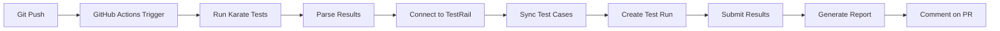

# Proyecto Karate - API Testing 🥋

Proyecto completo de testing de APIs usando **Karate Framework** con ejemplos prácticos y estructura profesional.

## 📋 Descripción

Este proyecto contiene pruebas automatizadas de APIs usando Karate, incluyendo:
- ✅ Pruebas CRUD completas
- ✅ Validación de esquemas JSON
- ✅ Pruebas de autenticación y autorización
- ✅ Data-driven testing
- ✅ Pruebas de integración
- ✅ Pruebas de performance
- ✅ Ejecución paralela
- 🤖 **Agente LangGraph para integrar resultados con Jira Xray**

## 🏗️ Estructura del Proyecto

```
agent-karate/
├── src/
│   └── test/
│       └── java/
│           ├── karate-config.js         # Configuración global
│           ├── TestRunner.java          # Runner principal
│           └── examples/
│               ├── users/               # Tests de usuarios
│               │   ├── UsersTest.java
│               │   └── users.feature
│               ├── posts/               # Tests de posts
│               │   ├── PostsTest.java
│               │   └── posts.feature
│               └── auth/                # Tests de autenticación
│                   ├── AuthTest.java
│                   └── auth.feature
├── agent/                               # Agente Python para TestRail
│   ├── __init__.py                      # Package init
│   ├── requirements.txt                 # Dependencias Python
│   ├── main.py                          # Entry point orquestador
│   ├── state.py                         # Estado y tipos
│   ├── karate_parser.py                 # Parser de resultados Karate
│   ├── testrail_client.py               # Cliente API TestRail (12+ métodos)
│   ├── testrail_sync.py                 # Sincronización de casos
│   └── testrail_runner.py               # Ejecución y reporte
├── .github/
│   └── workflows/
│       └── karate-testrail.yml          # GitHub Actions workflow (config-driven)
├── testrail.config.json                 # Configuración QA-editable
├── pom.xml                              # Dependencias Maven
├── README.md
└── .env                                 # Credenciales locales (git-ignored)
```

## 🚀 Instalación y Configuración

### 🚀 Inicio Rápido (5 minutos)

Para una configuración rápida del agente, ve a: **[QUICKSTART.md](QUICKSTART.md)**

### Prerequisitos

- **Java JDK 17** o superior
- **Maven 3.6+**
- Git (opcional)

### Pasos de Instalación

1. **Verificar instalación de Java:**
   ```bash
   java -version
   ```

2. **Verificar instalación de Maven:**
   ```bash
   mvn -version
   ```

3. **Instalar dependencias del proyecto:**
   ```bash
   mvn clean install -DskipTests
   ```

## 🧪 Ejecutar las Pruebas

### Ejecutar todas las pruebas
```bash
mvn test
```

### Ejecutar solo pruebas de smoke (@smoke)
```bash
mvn test -Dtest=TestRunner#testSmoke
```

### Ejecutar pruebas de regresión (@regression)
```bash
mvn test -Dtest=TestRunner#testRegression
```

### Ejecutar pruebas específicas

**Pruebas de usuarios:**
```bash
mvn test -Dtest=UsersTest
```

**Pruebas de posts:**
```bash
mvn test -Dtest=PostsTest
```

**Pruebas de autenticación:**
```bash
mvn test -Dtest=AuthTest
```

### Ejecutar en paralelo (5 threads)
```bash
mvn test -Dtest=TestRunner#testParallel
```

### Ejecutar en un ambiente específico
```bash
mvn test -Dkarate.env=qa
mvn test -Dkarate.env=prod
```

## 📊 Reportes

Los reportes HTML se generan automáticamente después de ejecutar las pruebas:

```
target/karate-reports/karate-summary.html
```

Abre el archivo en tu navegador para ver el reporte detallado con:
- ✅ Casos pasados/fallidos
- ⏱️ Tiempos de ejecución
- 📸 Request/Response details
- 🔍 Logs detallados

## 🏷️ Tags Disponibles

| Tag | Descripción |
|-----|-------------|
| `@smoke` | Pruebas de smoke - casos críticos básicos |
| `@regression` | Pruebas de regresión - casos completos |
| `@get` | Pruebas de método GET |
| `@post` | Pruebas de método POST |
| `@put` | Pruebas de método PUT |
| `@patch` | Pruebas de método PATCH |
| `@delete` | Pruebas de método DELETE |
| `@auth` | Pruebas de autenticación |
| `@negative` | Casos negativos |
| `@integration` | Pruebas de integración |
| `@performance` | Pruebas de performance |
| `@datadriven` | Pruebas data-driven |

## 🔧 Configuración de Ambientes

El archivo `karate-config.js` permite configurar diferentes ambientes:

```javascript
// Cambiar ambiente al ejecutar
mvn test -Dkarate.env=qa
```

Ambientes disponibles:
- **dev** (por defecto)
- **qa**
- **prod**

## 📝 Ejemplos de Features

### 1. Users API (`users.feature`)
- ✅ Obtener lista de usuarios
- ✅ Obtener usuario por ID
- ✅ Crear usuario
- ✅ Actualizar usuario (PUT/PATCH)
- ✅ Eliminar usuario
- ✅ Validación de esquemas
- ✅ Data-driven tests

### 2. Posts API (`posts.feature`)
- ✅ Listar posts
- ✅ Filtrar posts por usuario
- ✅ CRUD completo
- ✅ Flujo de integración
- ✅ Validación de tiempos de respuesta

### 3. Authentication (`auth.feature`)
- ✅ Login con token
- ✅ Registro de usuarios
- ✅ Validación de headers
- ✅ Casos negativos

## 🎯 Características Destacadas

1. **Validación de Esquemas JSON:** Validación robusta de estructuras de datos
2. **Data-Driven Testing:** Ejecutar el mismo test con múltiples datos
3. **Reusabilidad:** Funciones globales en `karate-config.js`
4. **Ejecución Paralela:** Acelera la ejecución de pruebas
5. **Reportes Detallados:** HTML reports con toda la información
6. **Multi-ambiente:** Soporte para dev, qa, prod

## 🔍 Tips y Mejores Prácticas

1. **Usar Background:** Para configuración común en todos los scenarios
2. **Tags apropiados:** Organizar tests con tags significativos
3. **Assertions precisas:** Usar match operators de Karate
4. **Variables compartidas:** Usar `def` para reutilizar datos
5. **Timeouts configurables:** Ajustar según necesidad

## 🤖 Agente LangGraph - Karate a Jira Xray

Este proyecto incluye un agente inteligente que procesa los resultados de Karate y los importa automáticamente a Jira Xray.

### 🎯 Funcionalidades del Agente

- **Analiza** resultados de Karate con LLM (OpenAI, Claude, Ollama, etc.)
- **Mapea** tests a issues de Jira Xray automáticamente
- **Importa** ejecuciones de prueba a Jira Xray
- **Soporta** múltiples proveedores de LLM

### 🚀 Configuración Rápida

1. **Elegir proveedor LLM** (Ollama recomendado para empezar):
   ```bash
   cd agent
   cp .env.example .env
   ```

2. **Editar .env:**
   ```env
   LLM_PROVIDER=ollama  # o openai, anthropic, azure
   JIRA_BASE_URL=https://tu-jira.atlassian.net
   JIRA_EMAIL=tu-email@company.com
   JIRA_API_TOKEN=tu-token
   XRAY_PROJECT_KEY=PROJ
   ```

3. **Instalar dependencias:**
   ```bash
   pip install -r agent/requirements.txt
   ```

4. **Ejecutar agente:**
   ```bash
   python agent/main.py target/karate-reports/karate-summary.json
   ```

### 📚 Documentación Detallada

- [Documentación del Agente](agent/README-AGENT.md)
- [Proveedores LLM Disponibles](agent/LLM_PROVIDERS.md)
- [Estructura de Tickets en Jira Xray](JIRA_XRAY_STRUCTURE.md)

## 📚 Recursos Útiles

- [Documentación Oficial de Karate](https://github.com/karatelabs/karate)
- [Karate DSL Reference](https://github.com/karatelabs/karate#syntax-guide)
- [API de Prueba - JSONPlaceholder](https://jsonplaceholder.typicode.com/)
- [API de Prueba - ReqRes](https://reqres.in/)

## 🛠️ Troubleshooting

### Error: Java version
```bash
# Verificar versión de Java
java -version

# Debe ser Java 17 o superior
```

### Error: Maven no encontrado
```bash
# Instalar Maven
# Windows: usar chocolatey o descargar de https://maven.apache.org/
```

### Tests no se ejecutan
```bash
# Limpiar y reinstalar
mvn clean install
mvn test
```

## � TestRail Integration (NUEVO - Enero 2026)

### ¿Qué Logramos?

✅ **Automatización end-to-end**: Karate → TestRail  
✅ **Sincronización automática de casos**: Los tests de Karate se crean como casos en TestRail  
✅ **Ejecución en GitHub Actions**: Cada push dispara tests y sincroniza con TestRail  
✅ **Reportes automáticos**: Markdown reports con resumen de ejecución  
✅ **Arquitectura config-driven**: QA puede cambiar proyecto/suite sin tocar código  
✅ **Soporte multi-LLM**: OpenAI, Azure, Anthropic, Google Gemini, Ollama, ZAI (GLM)  

### 📊 Estructura TestRail

```
Project: karate automation (ID: 2)
└── Suite: API v1 (ID: 6)
    ├── Section: Authentication (ID: 30)
    │   └── Test Cases (creados automáticamente)
    ├── Section: Users Management (ID: 31)
    │   └── Test Cases (creados automáticamente)
    └── Section: Posts & Content (ID: 32)
        └── Test Cases (creados automáticamente)
```

### 🔧 Setup para QA - Pasos Necesarios

#### **1. Configurar TestRail**

1. Crear un **Project** en TestRail (e.g., "karate automation")
2. Crear una **Suite** dentro del proyecto (e.g., "API v1")
3. Crear 3 **Sections** en esa suite:
   - `Authentication`
   - `Users Management`
   - `Posts & Content`

#### **2. Obtener Credenciales de TestRail**

1. Ir a: `https://tucompania.testrail.io/index.php?/user/profile/settings`
2. Copiar el **Email** y **API Key**
3. Obtener la **URL base**: `https://tucompania.testrail.io`

#### **3. Configurar GitHub Secrets**

En el repositorio → Settings → Secrets and variables → Actions:

```
TESTRAIL_URL          = https://tucompania.testrail.io
TESTRAIL_EMAIL        = tu-email@empresa.com
TESTRAIL_API_KEY      = 1a2b3c4d5e6f7g8h9i0j (copiar de TestRail)
```

#### **4. Configurar el Archivo de Configuración**

Editar `testrail.config.json` en la raíz del proyecto:

```json
{
  "testrail": {
    "project_id": 2,
    "suite_id": 6,
    "environment": "dev"
  }
}
```

**Obtener los IDs:**
- **project_id**: En TestRail, ir al proyecto → URL contiene `/projects/2`
- **suite_id**: En la suite → URL contiene `/suites/6`

#### **5. Entorno Local (Opcional - Para Testing)**

```bash
# Crear archivo .env en la raíz
cat > .env << EOF
TESTRAIL_URL=https://tucompania.testrail.io
TESTRAIL_EMAIL=tu-email@empresa.com
TESTRAIL_API_KEY=tu-api-key
TESTRAIL_PROJECT_ID=2
TESTRAIL_SUITE_ID=6
EOF

# Instalar dependencias Python
pip install -r agent/requirements.txt

# Ejecutar localmente
python -m agent.main
```

### 📈 Flujo de Automatización



### 🔍 ¿Cómo Funciona?

1. **Cada push a main/develop** dispara el workflow `.github/workflows/karate-testrail.yml`
2. **Maven ejecuta** los tests en `src/test/java/examples/`
3. **El agente Python** (agent/main.py):
   - Parsea resultados de Karate
   - Se conecta a TestRail
   - Sincroniza casos (crea/actualiza automáticamente)
   - Crea un nuevo Test Run
   - Envía los resultados
   - Adjunta artefactos
   - Comenta en la PR con el resumen
4. **Resultado final**: Todos los tests sincronizados en TestRail, listos para tracking

### 📋 Campos Automáticos

Cada test sincronizado incluye:
- **Title**: Nombre del scenario de Karate
- **Automation ID**: ID único para no duplicar
- **Environment**: Extraído de config (dev/staging/prod)
- **Status**: Passed/Failed basado en ejecución

### 🐛 Troubleshooting

| Problema | Solución |
|----------|----------|
| Error: "Cannot connect to TestRail" | Verificar TESTRAIL_URL, EMAIL, API_KEY en GitHub Secrets |
| Error: "No sections found" | Verificar que existan las 3 secciones en TestRail |
| Test cases no se sincronizan | Revisar logs del workflow en GitHub Actions |
| Payload error 400 | Verificar que project_id y suite_id sean correctos |

---

## 📋 Actualización: Formato Automatizado en TestRail (Enero 2026)

### ✅ Cambios Implementados

**Scenario Outline con Tablas:**
- ✅ `auth.feature` → Login con 3 casos (1 positivo + 2 negativos)
- ✅ `posts.feature` → Get y Create con 8+ casos parametrizados

**Descripción HTML Automática:**
- 📋 Feature claramente identificada
- 📝 Steps organizados en lista formateada
- ✅/❌ Status real (PASSED/FAILED) en badge con colores
- ⏱️ Tiempo de ejecución
- ❌ Detalles de error (si falló)
- 🤖 Marcado como automatizado

**Prioridades Auto-Inferidas:**
- 🔴 Critical (5): detecta "critical", "smoke", "main"
- 🟡 Low (2): detecta "negative", "error"
- 🟢 Medium (3): resto

**Ejemplo en TestRail:**
```
Case C38: Validación de login con diferentes credenciales
Status: ✅ PASSED | ⏱️ 1.23s
Automated: YES
Priority: MEDIUM

Description:
📋 Feature: Autenticación y Autorización
Status: ✅ PASSED | ⏱️ 1.23s

📝 Test Steps:
  • Given path '/login'
  • When method POST
  • Then status 200

⚙️ Automation Info:
type: karate | framework: karate-dsl | automated: yes
```

### 🚀 Para Ejecutar

```bash
# 1. Ejecutar tests
mvn test -Dtest=TestRunner

# 2. Sincronizar con TestRail
python agent/main.py
```

Resultado: Todos los casos sincronizados con status real, HTML formateado y marcados como automatizados.

### 📚 Variables de Entorno Usadas por el Workflow

```
BUILD_NUMBER     = ${{ github.run_number }}
BRANCH_NAME      = rama actual (main, develop, feature/*)
COMMIT_SHA       = hash del commit
COMMIT_MESSAGE   = mensaje del commit
JIRA_PARENT_ISSUE = extraído del nombre de rama (e.g., SCRUM-4)
```

---

## 🤖 AI Feedback en Pipeline (Enero 2026)

### ¿Qué es?

El agente genera **análisis inteligente de resultados** usando LLM durante la ejecución del pipeline.

### 📊 Tipos de Feedback

**1. Resumen Analítico**
```
Pass Rate: 87.5% (7/8 tests)
Critical Failures: 0
High-Risk Tests: 1 (auth_negative_invalid_email)
Performance Issues: 0

✅ Strengths:
- Authentication workflow is rock-solid (100% pass)
- Post creation tests are consistent

⚠️ Areas of Concern:
- User deletion test needs optimization (3.2s)
```

**2. Análisis de Fallos**
```
Root Cause Analysis:
- auth_negative_missing_password: Returns 401 instead of 400
  → Suggestion: API validation should return 400 for missing fields
  
- post_update_invalid_id: Database timeout
  → Suggestion: Add connection pooling or increase timeout to 5s
```

**3. Recomendaciones de Performance**
```
🚀 Optimization Opportunities:
- users_list endpoint: 4.1s → Target: < 2s
  Consider: Add caching, pagination, or query optimization
  
- posts_create endpoint: 1.8s → Good, but watch for regression
```

### 🔧 Configuración

En GitHub Actions (`.github/workflows/karate-testrail.yml`):

```yaml
- name: Run Tests & Generate AI Feedback
  env:
    LLM_PROVIDER: glm  # o openai, azure, anthropic, google, ollama
    OPENAI_API_KEY: ${{ secrets.OPENAI_API_KEY }}  # si usas openai
    TESTRAIL_URL: ${{ secrets.TESTRAIL_URL }}
    TESTRAIL_EMAIL: ${{ secrets.TESTRAIL_EMAIL }}
    TESTRAIL_API_KEY: ${{ secrets.TESTRAIL_API_KEY }}
  run: |
    mvn test
    python -m agent.main
```

### 📍 Proveedores LLM Soportados

| Proveedor | Requisito | Mejor para |
|-----------|-----------|-----------|
| `glm` | API key de Zhipu | Rápido, económico (defecto) |
| `openai` | OpenAI API key | Mejor calidad análisis |
| `azure` | Azure OpenAI credentials | Empresas Azure |
| `anthropic` | Claude API key | Análisis profundo |
| `google` | Google Gemini API key | Flexible, multimodal |
| `ollama` | Ollama local (localhost:11434) | Privado, sin internet |

### 🛠️ Configuración Local

```bash
# 1. Instalar dependencias
pip install -r agent/requirements.txt

# 2. Exportar API key (ej: OpenAI)
export OPENAI_API_KEY=sk-xxx...

# 3. Ejecutar con feedback
export LLM_PROVIDER=openai
python agent/main.py
```

### 📋 Salida en Pipeline

El feedback aparece en:
1. **Logs de GitHub Actions**: Visible en tab "Run Tests"
2. **Artifact**: Archivo `testrail-run-data.json` con feedback incluido
3. **PR Comment**: Resumen ejecutivo del feedback (próxima versión)

### 🎯 Ejemplo Real

Salida en logs durante ejecución:
```
============================================================
🤖 AI FEEDBACK & INSIGHTS
============================================================

📊 TEST RESULTS SUMMARY
Pass Rate: 87.5% (7 of 8 tests)
Execution Time: 12.4s
Environment: dev

✅ Test Results Analysis:
- Critical passes: authentication workflow (100%)
- Moderate concerns: 1 failure in user deletion flow
- Performance: 2 tests above baseline (>2s)

🔍 FAILURE ROOT CAUSE ANALYSIS
Test: user_delete_invalid_id
Expected: 404 Not Found
Actual: 500 Internal Server Error
Root Cause Hypothesis:
  The user deletion endpoint throws a 500 when given an invalid
  integer ID format. Expected behavior should be 404.

Recommendation:
  Add input validation to convert invalid IDs to 404 before database query

🚀 PERFORMANCE OPTIMIZATION OPPORTUNITIES
1. GET /users list endpoint: 3.8s (target: 2s)
   - Consider: Add pagination query params, use cursor-based pagination
   - Expected improvement: 1.5-2x speedup

2. POST /posts endpoint: 2.1s (target: 1.5s)
   - Consider: Batch inserts or async processing
   - Expected improvement: 30-40% faster

============================================================
✅ Run #42
============================================================
```

### 💡 Mejor Práctica

1. **En desarrollo**: Usar `glm` o `ollama` (rápido, gratis/local)
2. **En CI/CD**: Usar `openai` o `anthropic` (mejor calidad)
3. **En producción**: Usar `azure` (control empresarial) o `ollama` (privado)

### 🎯 Siguiente: Analytics y Notificaciones

Próximas features plaaneadas:
- 📊 Dashboard de métricas históricas
- 🔔 Notificaciones en Slack/Teams
- 🚨 Alertas por tasa de fallos
- 📈 Detección de tests flaky
- 🏆 Tracking de cobertura
- 💬 AI Feedback en PR comments

---

## �📧 Contacto

Para preguntas o sugerencias sobre este proyecto de Karate.

---

**¡Happy Testing! 🥋**
